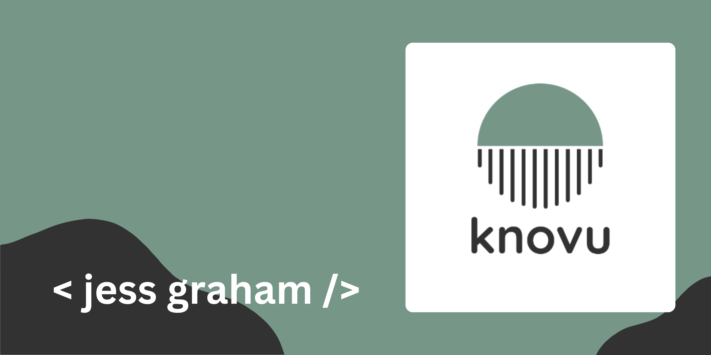

### Hi there, nice to meet you 👋

My name is Jess Graham 🚀 and I'm a senior software engineer 🧑‍💻.

## 🧑‍🤝‍🧑 Connect

## 💻 Tech

<!-- Global -->

<!-- Code -->

<!-- Tools -->

<!-- Infra -->

## 📊 Stats

<!--
**knovu/knovu** is a ✨ _special_ ✨ repository because its `README.md` (this file) appears on your GitHub profile.

Here are some ideas to get you started:

- 🔭 I’m currently working on ...
- 🌱 I’m currently learning ...
- 👯 I’m looking to collaborate on ...
- 🤔 I’m looking for help with ...
- 💬 Ask me about ...
- 📫 How to reach me: ...
- 😄 Pronouns: ...
- ⚡ Fun fact: ...
-->
